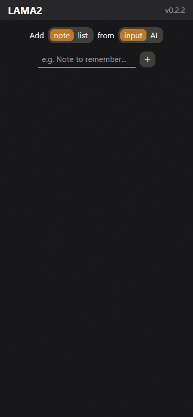

<div align="center" >
  
  <h1>LAMA2</h1>
</div>

<div align="center" >
  <h4>
    <a href="https://lama2-delta.vercel.app/">View Demo*</a>
    <span> · </span>
    <a href="https://github.com/alepemu/lama2">Documentation</a>
    <span> · </span>
    <a href="https://github.com/alepemu/lama2/issues">Report Bug / Request Feature</a>
  </h4>
</div>

#### LAMA2 is an enhanced version of the original project LAMA (Life Admin Management Advisor) incorporating new features like TypeScript, Redux, AI-powered note generation, drag-and-drop and more.


**Currently under development; demo data is stored locally; backend server (AI) might be unavailable.*

## 📄 About the Project

### 📷 Media

<div align="center"> 
  
</div>

### 🛰️ Tech Stack

- Vite
- TypeScript
- React
- Redux
- shadcn/ui
- Tailwind CSS
- Vitest
- Testing Library
- Happy DOM

### ✨ Main Features

- Sortable text and list notes with drag-and-drop capability.
- Responsive interface and interactions across different devices.
- Implementation of AI-generated notes/lists when connected to OpenAI.
- Note title, text/list and theme customization via dialogs.

### 🎨 Theme

| Color           | Hex                                                              |
| --------------- | ---------------------------------------------------------------- |
| Primary Color   |  #18181B |
| Secondary Color |  #27272A |
| Accent Color    |  #D97706 |
| Text Color      |  #FAFAFA |

### 🗝️ Environment Variables

To run this project, you will need to add the following environment variables to your .env file

`VITE_APP_OPENAI_API_KEY` *(not yet available)*

## 🏁 Getting Started

### ⚙️ Installation

Clone the project, change to the project directory and install dependencies

```bash
git clone https://github.com/alepemu/lama2.git
cd lama2
npm i
```

### 👟 Run Locally

Start the local server

```bash
  npm run dev
```

### 🧪 Running Tests

To run tests, run the following command

```bash
  npm run test
```

## 🧭 Roadmap and ideas

- [x] Frontend note manipulation
- [ ] Backend and database integration
- [ ] Profiles and authentication
- [ ] Include light mode
- [ ] Add email notifications
- [ ] Make it PWA (offline and push notifications)

## 👨‍💻 Contact

Alejandro - [www.alepemu.me](https://www.alepemu.me) - @ apenalvermunita@gmail.com  
Project Link: [https://github.com/alepemu/lama2](https://github.com/alepemu/lama2)

## 💎 Acknowledgements

Useful resources and libraries:

- [LAMA](https://github.com/alepemu/lama)
- [dnd kit](https://dndkit.com/)
- [shadcn/ui](https://ui.shadcn.com/)
- [Awesome Readme Template](https://github.com/Louis3797/awesome-readme-template)
